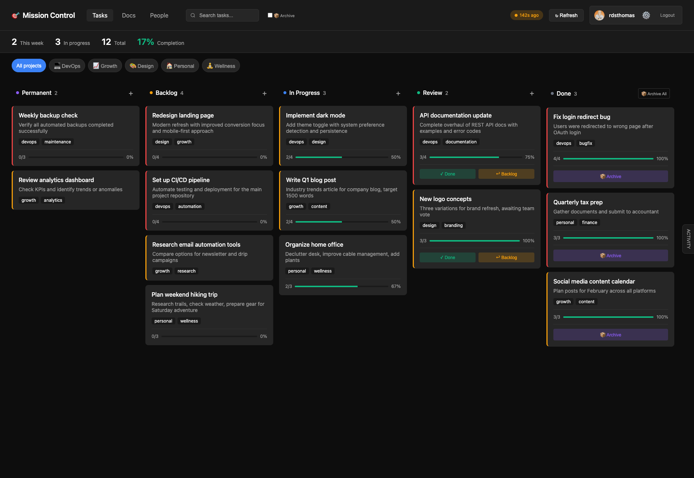
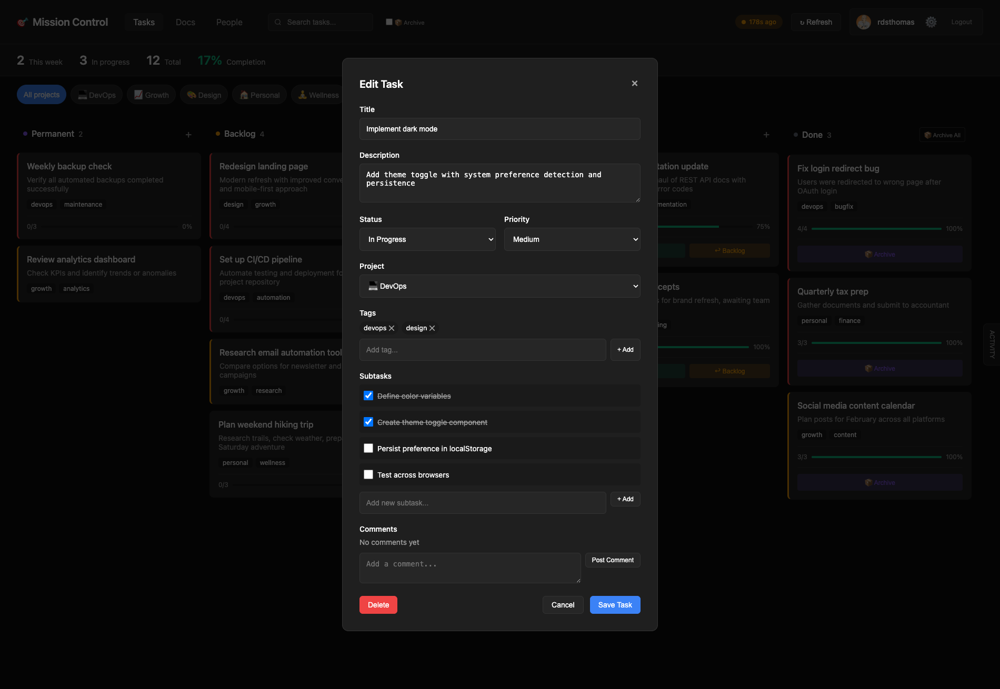
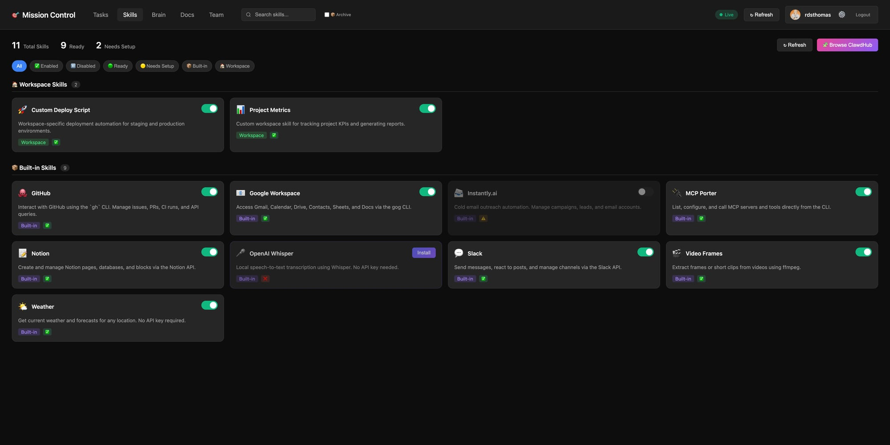
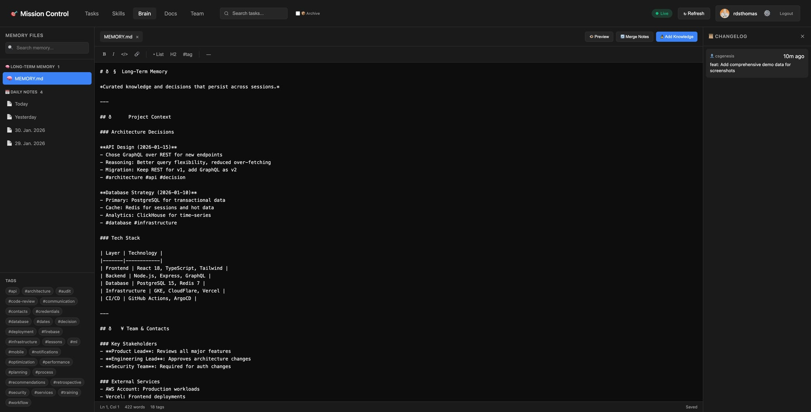

# Mission Control 🎛️

**The visual layer your AI assistant is missing.**

> Chat conversations are linear. Projects aren't.

[](https://github.com/rdsthomas/mission-control/releases/tag/v2.0.0)
[](https://github.com/rdsthomas/mission-control)
[](LICENSE)
[](https://github.com/clawdbot/clawdbot)
[](https://discord.gg/clawd)



---

## Why Mission Control?

You've set up Clawdbot. It's brilliant — answers on WhatsApp, automates your workflows, even writes code for you. But after a week of conversations, you have **50+ tasks scattered across hundreds of messages**.

Where was that API refactor task? Did the dark mode feature get completed? What's actually in progress right now?

**Mission Control gives your AI assistant a visual brain.**

| Without Mission Control | With Mission Control |
|------------------------|---------------------|
| Tasks buried in chat history | All tasks on one Kanban board |
| "What was I working on?" | Instant visual status |
| Lost context between sessions | Persistent, organized backlog |
| AI works, you lose track | AI works, dashboard updates |

---

## Who Is This For?

### 🛠️ Solo Developers & Indie Hackers
You're building products while juggling a dozen parallel workstreams. Clawdbot helps you code, but you need to **see** the big picture. Mission Control turns your AI conversations into a project board.

### ⚡ Productivity Enthusiasts
You've optimized everything — but your AI assistant's output is still trapped in linear chat. Mission Control extracts actionable tasks from conversations and tracks them visually.

### 🔒 Self-Hosters & Privacy-Conscious Users
Your data stays yours. Mission Control runs on GitHub Pages from your own repo. No external services, no tracking, no cloud lock-in.

---

## Features

- 📋 **Kanban Board** — Permanent, Backlog, In Progress, Review, Done
- 🤖 **AI-Native** — Clawdbot can create, update, and complete tasks via chat
- 👤 **Human-Friendly** — You can drag & drop in the dashboard
- 🔄 **GitHub Sync** — Auto-save to your repo, hosted on GitHub Pages
- 🔔 **Webhooks** — Clawdbot gets notified instantly when you move tasks
- 🎨 **Projects & Tags** — Organize by project, filter by context
- 🧩 **Dynamic Config** — Environment variable fallbacks for flexible deployment
- 🧠 **Brain Tab** — Long-term memory with daily notes, tags, and changelogs
- 🔌 **Skills Management** — View and configure your AI assistant's capabilities



### Skills Tab

Manage your AI assistant's capabilities. See what's installed, what needs setup, and browse ClawdHub for more.



### Brain Tab

Your AI's memory, visualized. Edit MEMORY.md, browse daily notes, and track knowledge over time.



---

## Quick Start

### Via ClawdHub (Recommended)

```bash
clawdhub install mission-control
```

Then just tell your AI: **"Set up Mission Control for my workspace"**

The agent will:
1. Check prerequisites (Tailscale, gh CLI)
2. Copy dashboard files to your workspace
3. Create config file
4. Install webhook transform
5. Set up GitHub webhook
6. Push to GitHub and enable Pages

**That's it.** Agent-guided setup handles everything.

### Manual Installation

```bash
git clone https://github.com/rdsthomas/mission-control.git
cd mission-control
# Follow SKILL.md for manual setup steps
```

---

## How It Works

```
┌─────────────────────────────────────────────────────────────────┐
│                        YOUR WORKFLOW                            │
├─────────────────────────────────────────────────────────────────┤
│                                                                 │
│  💬 CHAT                           📊 DASHBOARD                 │
│  ─────                             ─────────                    │
│                                                                 │
│  "Plan the Q1 roadmap"      ──►    📋 Backlog: Q1 Roadmap      │
│                                         ├── Feature A           │
│                                         └── Feature B           │
│                                                                 │
│  "Start Feature A"          ──►    🚀 In Progress: Feature A   │
│                                                                 │
│  [Clawdbot works...]        ◄──    Updates subtasks & comments │
│                                                                 │
│  [You review in dashboard]  ──►    ✅ Done: Feature A          │
│                                                                 │
└─────────────────────────────────────────────────────────────────┘
```

**Bidirectional:** Both you AND Clawdbot can create, edit, move, and complete tasks. Work from the dashboard or via chat — everything stays in sync.


---

## Bidirectional Workflow

### Two Ways to Work

| Action | 👤 You (Dashboard) | 🤖 Clawdbot (Chat/CLI) |
|--------|-------------------|----------------------|
| Create task | Click "+" button | Natural language or CLI |
| Edit task | Click card → Edit | `mc-update.sh` or JSON |
| Move task | Drag & drop | Change status via CLI |
| Add comment | Type in comment box | `mc-update.sh comment` |
| Complete | Drag to Done | `mc-update.sh complete` |

### Example: Planning via Chat

**You:** *"Let's implement dark mode"*

**Clawdbot:** *"I'll create an implementation plan:"*

```
📋 Task: Implement Dark Mode
├── Define color variables (CSS custom properties)
├── Create theme toggle component  
├── Persist preference in localStorage
├── Detect system preference
└── Test across browsers
```

*"Added to your Backlog. Move to In Progress when ready!"*

### Chat Commands

Talk naturally — Clawdbot understands:

- *"Create a task for refactoring the auth module"*
- *"Add a subtask: write unit tests"*
- *"Move dark mode to review"*
- *"What's in progress?"*
- *"Archive completed tasks"*

---

## CLI Tool

Use `mc-update.sh` for task management:

```bash
# Status changes
mc-update.sh status <task_id> review
mc-update.sh status <task_id> done

# Comments
mc-update.sh comment <task_id> "Progress update..."

# Subtasks
mc-update.sh subtask <task_id> sub_1 done

# Complete (moves to review + adds summary)
mc-update.sh complete <task_id> "Summary of what was done"

# Push to GitHub
mc-update.sh push "Commit message"
```

---

## Documentation

| Document | Description |
|----------|-------------|
| [SKILL.md](SKILL.md) | Agent-focused setup guide |
| [ARCHITECTURE.md](ARCHITECTURE.md) | Technical deep-dive |
| [docs/PREREQUISITES.md](docs/PREREQUISITES.md) | Installation requirements |
| [docs/HOW-IT-WORKS.md](docs/HOW-IT-WORKS.md) | System architecture |
| [docs/TROUBLESHOOTING.md](docs/TROUBLESHOOTING.md) | Common issues & fixes |

---

## What's New in v2.0.0

- 🔧 **Dynamic Config Loading** — `loadConfig()` with environment variable fallbacks
- 📖 **Agent-Guided Setup** — Just say "set up Mission Control" and the AI handles it
- 📚 **Comprehensive Docs** — Prerequisites, architecture, troubleshooting (10 issues covered)
- 🎯 **EPIC Support** — Handle parent tasks with multiple child tickets
- ⚙️ **Example Configs** — Ready-to-use templates in `assets/examples/`

See [CHANGELOG.md](CHANGELOG.md) for full details.

---

## Troubleshooting

### "Cannot find package 'undici'" during installation

This error comes from the ClawdHub CLI, not Mission Control:

```
Error [ERR_MODULE_NOT_FOUND]: Cannot find package 'undici' imported from .../clawdhub/dist/http.js
```

**Fix:** Reinstall ClawdHub to ensure all dependencies are properly installed:

```bash
npm install -g clawdhub
```

Then retry the installation:

```bash
clawdhub install mission-control
```

For more issues, see [docs/TROUBLESHOOTING.md](docs/TROUBLESHOOTING.md).

---

## Community & Support

- 💬 **Discord:** [discord.gg/clawd](https://discord.gg/clawd) — Clawdbot community (8.9K+ members)
- 📖 **Docs:** [ARCHITECTURE.md](ARCHITECTURE.md) — How it all works
- 🐛 **Issues:** [GitHub Issues](https://github.com/rdsthomas/mission-control/issues)
- 🌟 **Star this repo** if Mission Control helps you stay organized!

---

## License

MIT License — see [LICENSE](LICENSE).

Built for [Clawdbot](https://github.com/clawdbot/clawdbot) 🦞

---

<p align="center">
  <b>Stop losing tasks in chat. Start shipping.</b><br>
  <a href="https://rdsthomas.github.io/mission-control/">Try the Demo</a> · <a href="https://discord.gg/clawd">Join Discord</a> · <a href="https://github.com/rdsthomas/mission-control">⭐ Star on GitHub</a>
</p>
